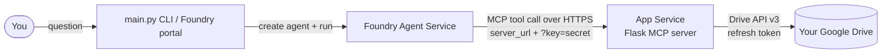

# Foundry Agent + Google Drive (self-hosted MCP)

A working example of a **Microsoft Foundry agent** that answers natural-language
questions about **your personal Google Drive** — through a small **Google Drive
MCP server you host yourself on Azure App Service**:

> _"¿Qué documentos tengo en Drive?"_
> _"Resume el archivo 'Viaje molón a Japón'."_
> _"¿Qué dice mi plan de marketing sobre el presupuesto?"_

Built with the new **Microsoft Foundry SDK** — [`azure-ai-projects`](https://pypi.org/project/azure-ai-projects/)
2.x *prompt agents* + the OpenAI-compatible **Responses API** — and the
[Model Context Protocol (MCP)](https://modelcontextprotocol.io/).

Because the Google identity lives **server-side** (a refresh token stored on the
App Service), the agent works the same from this CLI **and from the Foundry web
portal** — no localhost, no per-user OAuth.

---

## Why a self-hosted MCP server?

Google publishes a **hosted** Drive MCP server at `drivemcp.googleapis.com`. In
testing with a **personal `@gmail.com` account** it lets you `initialize` and
`tools/list`, but **denies every data-plane call** (`search_files`,
`list_recent_files`, …) with:

```
The caller does not have permission
```

…even though the OAuth client is a Web app, both scopes are granted, the Drive
API is enabled, and the **raw Drive API v3 returns your files with the exact same
token** (proven by `check_drivemcp.py`). The hosted MCP is a restricted preview,
and nothing you change client-side fixes it for a consumer Google account.

**Solution:** host a tiny MCP server (`webapp/`) that speaks the same MCP protocol
but calls the **plain Drive API v3** (which works). It runs on Azure App Service
and holds your Google refresh token in app settings.

---

## Architecture



1. **Foundry agent** (`agents.create_version` + `PromptAgentDefinition`) has one
   tool: an **MCP tool** pointing at your App Service URL, e.g.
   `https://<app>.azurewebsites.net/mcp?key=<shared-secret>`.
2. The **App Service** (`webapp/`) implements MCP (`initialize`, `tools/list`,
   `tools/call`) and exposes three tools: `search_files`, `list_files`,
   `get_file_content`.
3. It authenticates the caller with a **shared secret in the URL** and calls the
   **Drive API v3** using a stored **refresh token** (exchanged for short-lived
   access tokens on demand).
4. Chat happens over the OpenAI-compatible **Responses API** on a `conversation`,
   so multi-turn context is preserved. The service runs the MCP tools and returns
   the answer.

**Two auth hops, both server-to-server:**

| Hop | Mechanism |
| --- | --- |
| Foundry → App Service | Shared secret in the `server_url` query (`?key=…`) |
| App Service → Google | OAuth refresh token (`GOOGLE_CLIENT_ID/SECRET/REFRESH_TOKEN` app settings) |

---

## Prerequisites

- **Python 3.10+** and **Azure CLI** (`az login`).
- An **Azure subscription** with a **Microsoft Foundry project** + a deployed chat
  model (this repo uses `gpt-4o-mini`). Provisioned here via `infra/foundry.bicep`.
- A **Google account** with files in Drive, and a **Google Cloud project** where
  you can enable the Drive API and create a **Web** OAuth client.

---

## Part 1 — Google Cloud setup

You only need the **Drive API** (not the hosted MCP service) and a **Web** OAuth
client whose JSON you save as `credentials.json`.

### 1.1 Enable the Drive API

```bash
gcloud services enable drive.googleapis.com --project=PROJECT_ID
```

(Console: **APIs & Services → Enable APIs and services → Google Drive API**.)

### 1.2 OAuth consent screen

**Google Auth Platform → Branding**: set an app name and support email. Under
**Audience**, choose **External** and add your own email as a **Test user** (or
**Internal** if it's a Workspace org). Under **Data Access → Add scopes**, add:

- `https://www.googleapis.com/auth/drive.readonly`
- `https://www.googleapis.com/auth/drive.file`

### 1.3 Create a **Web application** OAuth client

**Google Auth Platform → Clients → Create Client → Application type: Web
application**. Add the authorized redirect URI:

```
http://localhost:8765/
```

Create it and **Download JSON** → save as `credentials.json` in the repo root.

> If the download button doesn't work, copy the **Client ID** and **Client
> secret** into a `credentials.json` of this shape:
>
> ```json
> {
>   "web": {
>     "client_id": "…apps.googleusercontent.com",
>     "project_id": "your-project",
>     "auth_uri": "https://accounts.google.com/o/oauth2/auth",
>     "token_uri": "https://oauth2.googleapis.com/token",
>     "client_secret": "GOCSPX-…",
>     "redirect_uris": ["http://localhost:8765/"]
>   }
> }
> ```

---

## Part 2 — Deploy the MCP server to Azure App Service

The Foundry project is already provisioned (`infra/foundry.bicep`). Now stand up
the MCP web app.

> **Region note:** App Service **VM quota is regional**. If `F1`/`B1` fails with
> _"Operation cannot be completed without additional quota … Total VMs: 0"_ in
> your Foundry region, pick another region for the web app (this repo uses
> **westus2**). The web app does **not** need to be co-located with Foundry.

> **Use a plan with "Always On" (B1+), not Free (F1).** On Free/Shared tiers the
> app **idles out and cold-starts (~20 s)** on the next request. Foundry's MCP
> connector times out on that cold start and the agent run fails with
> `external_connector_error … Server returned 424`. **Basic (B1)** supports
> **Always On**, which keeps the container warm so the handshake is instant.

### 2.1 Provision (one time)

```bash
RG=Google-Drive
APP=gdrive-mcp-$RANDOM          # must be globally unique
REGION=westus2

az appservice plan create -g $RG -n gdrive-mcp-plan --is-linux --sku B1 --location $REGION
az webapp create -g $RG -p gdrive-mcp-plan -n $APP --runtime "PYTHON:3.11"
az webapp config set -g $RG -n $APP --startup-file "gunicorn --bind=0.0.0.0:8000 --timeout 600 app:app"
az webapp config appsettings set -g $RG -n $APP --settings SCM_DO_BUILD_DURING_DEPLOYMENT=true
az webapp config set -g $RG -n $APP --always-on true      # keep warm -> no cold-start 424
az webapp update -g $RG -n $APP --https-only true
```

### 2.2 Set the shared secret

Generate a long random secret and store it as an app setting (the Foundry agent
will send it in the URL):

```bash
# any long random string; keep a copy for your .env MCP_SERVER_URL
az webapp config appsettings set -g $RG -n $APP --settings MCP_SHARED_SECRET="<your-40-char-secret>"
```

### 2.3 Deploy the code

```bash
# PowerShell helper (zips webapp/ contents + az webapp deploy):
./scripts/deploy_webapp.ps1 -AppName $APP -ResourceGroup $RG
```

Verify it's live (no secret needed for health):

```bash
curl https://$APP.azurewebsites.net/
# {"status":"ok","server":{"name":"gdrive-mcp-appservice","version":"1.0.0"}}
```

---

## Part 3 — Connect your Google Drive to the server

### 3.1 Authenticate to Google (local, one time)

```bash
python -m venv .venv
# Windows: .\.venv\Scripts\Activate.ps1   | macOS/Linux: source .venv/bin/activate
pip install -r requirements.txt

python main.py auth      # opens a browser, writes token.json (incl. refresh token)
```

### 3.2 Push your Google credentials to the App Service

This reads your local `credentials.json` + `token.json` and stores the client
id/secret + **refresh token** as app settings. **Secrets go disk → Azure; they are
never printed or sent through anything else.**

```bash
./scripts/set_appservice_secrets.ps1 -AppName <your-app-name> -ResourceGroup Google-Drive
```

After this the MCP tools can actually read your Drive.

---

## Part 4 — Create the agent and test

Copy the env template and fill it in:

```bash
cp .env.example .env        # Windows: copy .env.example .env
```

Set:

- `PROJECT_ENDPOINT` — Foundry project endpoint.
- `MODEL_DEPLOYMENT_NAME` — e.g. `gpt-4o-mini`.
- `MCP_SERVER_URL` — `https://<your-app>.azurewebsites.net/mcp?key=<your-secret>`.

Then:

```bash
az login                                   # so DefaultAzureCredential gets a token

python main.py create-agent                # persists the agent (for the portal)
python main.py ask "¿qué documentos tengo en drive?"
python main.py chat                         # interactive loop
```

> Your signed-in identity needs a **Foundry data-plane role** on the Foundry
> account — e.g. **Azure AI Developer** + **Cognitive Services User** — *Owner
> alone is not enough* for data calls.

---

## Part 5 — Use it from the Foundry portal

`python main.py create-agent` publishes a persistent agent version. Open
[ai.azure.com](https://ai.azure.com) → your project → **Agents** → `gdrive-mcp-agent`
→ **Try in playground**, and ask the same questions. Because the Google identity
is server-side, no extra sign-in is needed.

---

## Available MCP tools

| Tool | Purpose |
| --- | --- |
| `search_files` | Find files by keyword (name + full text) |
| `list_files` | List recently modified files |
| `get_file_content` | Read a file's text (Docs/Slides→text, Sheets→CSV, PDF extracted, text as-is). Accepts `file_id` or `name` |

Restrict them with `MCP_ALLOWED_TOOLS` if you want (e.g. `search_files,get_file_content`).

---

## Configuration reference

| Variable | Where | Required | Default | Description |
| --- | --- | --- | --- | --- |
| `PROJECT_ENDPOINT` | `.env` | ✅ | — | Foundry project endpoint |
| `MODEL_DEPLOYMENT_NAME` | `.env` | ✅ | — | Deployed model name (`gpt-4o-mini`) |
| `MCP_SERVER_URL` | `.env` | ✅ | — | `https://<app>.azurewebsites.net/mcp?key=<secret>` |
| `MCP_SERVER_LABEL` | `.env` | | `google_drive` | Tool label |
| `MCP_ALLOWED_TOOLS` | `.env` | | _(all)_ | Comma-separated allow-list |
| `MCP_REQUIRE_APPROVAL` | `.env` | | `never` | `never` (service runs tools) or `always` (app auto-approves + logs) |
| `AGENT_NAME` | `.env` | | `gdrive-mcp-agent` | Agent name |
| `MCP_SHARED_SECRET` | App Service | ✅ | — | Secret the URL `?key=` must match |
| `GOOGLE_CLIENT_ID` | App Service | ✅ | — | From `credentials.json` (set by script) |
| `GOOGLE_CLIENT_SECRET` | App Service | ✅ | — | From `credentials.json` (set by script) |
| `GOOGLE_REFRESH_TOKEN` | App Service | ✅ | — | From `token.json` (set by script) |
| `MAX_CONTENT_CHARS` | App Service | | `12000` | Truncate file content length |

---

## Project layout

```
foundry-gdrive-mcp-agent/
├── main.py                 # CLI: auth / ask / chat / create-agent
├── check_google.py         # Diagnostic: verify Drive token directly
├── check_drivemcp.py       # Diagnostic: probe Google's hosted Drive MCP
├── requirements.txt        # Agent-side deps (Foundry SDK, Google auth)
├── .env.example
├── infra/
│   └── foundry.bicep       # Foundry account + project + model deployment
├── scripts/
│   ├── deploy_webapp.ps1           # Zip + deploy webapp/ to App Service
│   └── set_appservice_secrets.ps1  # Push Google creds (disk → Azure)
├── src/
│   ├── config.py           # Settings from environment
│   ├── google_auth.py      # Google OAuth 2.0 (obtain/refresh token, `auth` cmd)
│   └── foundry_agent.py    # Foundry prompt agent + MCP tool + approval loop
└── webapp/                 # The self-hosted Google Drive MCP server
    ├── app.py              # Flask wrapper (health + /mcp + shared-secret auth)
    ├── mcp_core.py         # MCP JSON-RPC + Drive API v3 logic (3 tools)
    ├── requirements.txt    # Web app deps (Flask, gunicorn, requests, pypdf)
    └── startup.txt         # gunicorn startup command
```

---

## Troubleshooting

- **Agent run fails with `external_connector_error` / `Server returned 424`** →
  Foundry's MCP connector couldn't reach the App Service in time — almost always a
  **cold start** on a Free/Shared plan. Move the app to **B1** and enable
  **Always On** (`az webapp config set --always-on true`), then retry. Confirm the
  app is warm first: `curl https://<app>.azurewebsites.net/` should return in <1 s.
  (Also restart-related: pushing app settings restarts the container, so wait a few
  seconds after `set_appservice_secrets.ps1` before running the agent.)
- **`DefaultAzureCredential` / data-plane 401–403** → `az login`; assign your
  identity a Foundry **data-plane** role on the account — e.g. **Azure AI
  Developer** + **Cognitive Services User** (Owner alone is control-plane only).
- **App Service create fails: "Total VMs: 0"** → no App Service quota in that
  region; deploy the web app to another region (e.g. `westus2`). It's independent
  of the Foundry region.
- **Health OK but tool calls return "missing Google credentials app settings"** →
  run `scripts/set_appservice_secrets.ps1` (Part 3.2).
- **Tool returns "Google token refresh failed"** → the refresh token is stale or
  from a different OAuth client. Delete `token.json`, re-run `python main.py auth`
  (uses the same Web client as `credentials.json`), then re-run the secrets script.
- **Agent run returns `unauthorized` / 401 from the app** → the `?key=` in
  `MCP_SERVER_URL` doesn't match `MCP_SHARED_SECRET` on the App Service. If Foundry
  strips the query string, move the secret into the URL **path** instead and add a
  matching route (advanced).
- **Nothing found for a file you know exists** → try `get_file_content` with the
  exact `name`, or `search_files` with a distinctive keyword; Drive search is
  fuzzy and `list_files` shows the most recent items.
- **Package/import errors** → this uses the **new** Foundry projects API
  (`azure-ai-projects>=2.3.0`, pulls in `openai`); not compatible with 1.x. Use a
  clean venv and `pip install -r requirements.txt`.
- **Hosted `drivemcp.googleapis.com` "caller does not have permission"** →
  expected for personal accounts; that's exactly why this repo self-hosts. See
  [Why a self-hosted MCP server?](#why-a-self-hosted-mcp-server).

---

## Security & limitations

- **Rotate any secret you have pasted anywhere** (chat, screenshots). Regenerate
  the Google **client secret** in the Cloud Console if it was exposed, then re-run
  `python main.py auth` + `scripts/set_appservice_secrets.ps1`.
- `credentials.json`, `token.json`, `.env`, `webapp_deploy.zip` are **git-ignored** —
  never commit them. The shared secret lives only in `.env` and App Service settings.
- The refresh token grants read access to your Drive; treat App Service settings
  like passwords. Keep the web app **HTTPS-only** (set above).
- **Indirect prompt injection:** documents can contain hidden instructions. Point
  the agent only at Drives you trust; set `MCP_REQUIRE_APPROVAL=always` while
  experimenting to review each tool call.
- This is a **demo/dev** pattern. For production, prefer a managed identity /
  connection-based credential store and per-user consent rather than a single
  server-side refresh token.

---

## References

- [Quickstart: Create a prompt agent (new Foundry SDK)](https://learn.microsoft.com/azure/foundry/agents/quickstarts/prompt-agent?tabs=python)
- [Connect Foundry agents to MCP servers](https://learn.microsoft.com/azure/foundry/agents/how-to/tools/model-context-protocol)
- [Google Drive API v3](https://developers.google.com/workspace/drive/api/reference/rest/v3)
- [Model Context Protocol](https://modelcontextprotocol.io/)

## License

[MIT](LICENSE)
